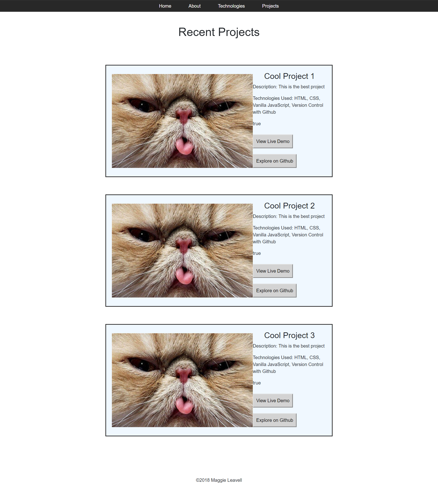

# Personal Bio Site

## Description
This project should be a single-page application that interacts with the user by dynamically rewriting the current page rather than loading entire new pages from the server. 

 ## Screenshots


 ## How to run this project
* Use npm to install http-server in your terminal:
```sh
npm install -g http-server
```
* Run the server in your terminal
```sh
hs -p 9999
```
* Open chrome and navigate to:
```
localhost:9999
```
 ## Contributors
[Maggie Leavell](https://github.com/mjleavell)